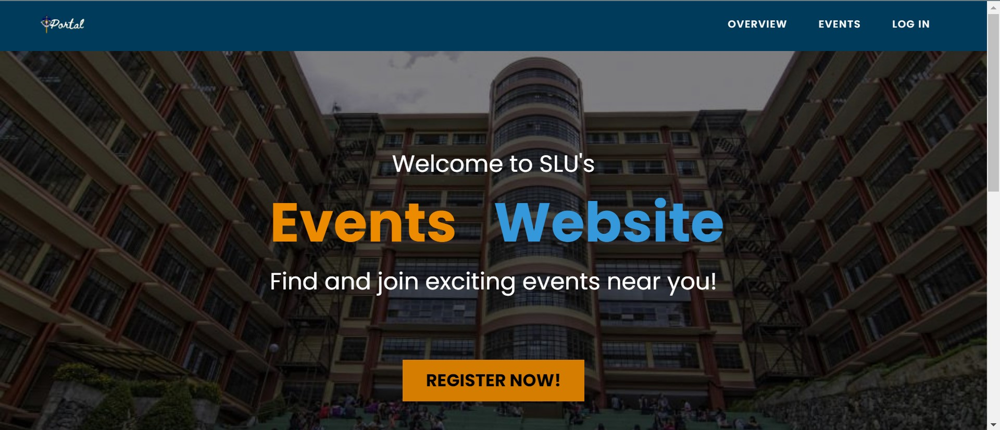
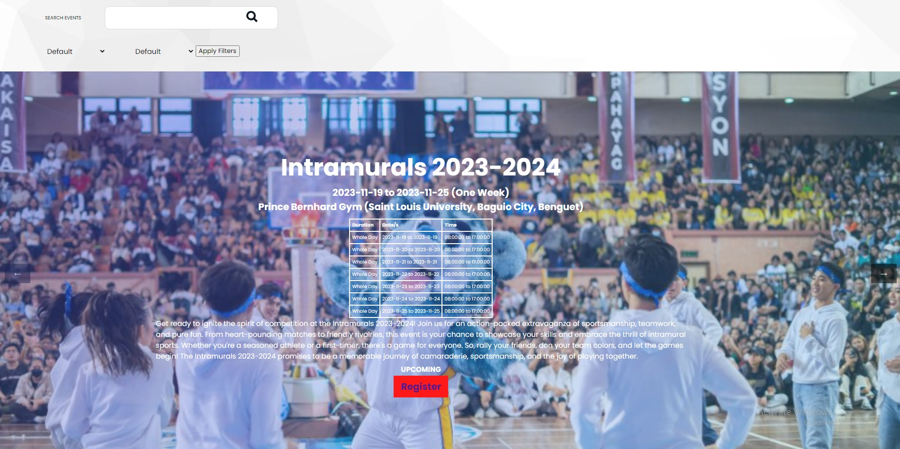
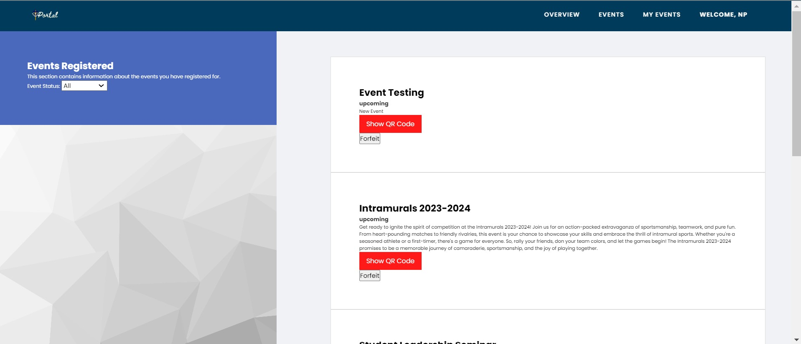
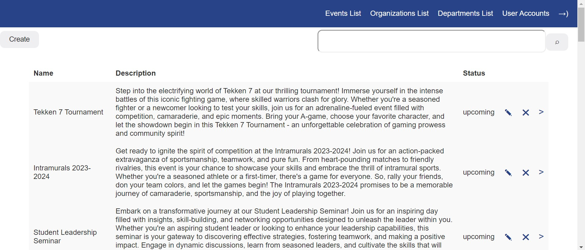

# Event Management System

This project consists of modules designed for managing users, events, and organizations within an event management system.

## Modules

### User Module

#### Public Part (Without Session handling)

- Provides general information about events accessible without login
- Allows users to create their own accounts by visiting the registration page and providing necessary information
- Displays an overview page showcasing the latest events for users

#### User Part (With Session handling)

- Allows users to log in to their accounts, either created by an admin or through self-registration
- Enables users to view all upcoming and ongoing events
- Allows users to join or cancel event registrations
- Provides QR Codes for registered events (via email or within the application)
- Enables users to edit their profiles

### Admin Module

#### User Management

- Allows admin to view all user accounts
- Permits admin to create user accounts and their respective credentials
- Facilitates editing of user account details
- Allows admin to delete user accounts
- Provides options to view, create, edit, and delete organizations
- Offers functionality to manage departments within organizations

#### Event Management

- Enables admin to create events
- Allows editing of event details, setting its type (private or public), or category (organization-specific or not), and managing registration status
- Provides reports for events, including registrations and attendance
- Enables admin to delete events
- Allows checking attendance per session for event attendees

## Screenshots (Website)

*Public Events Page*

*User Dashboard*

*User Event Page*

*Admin Panel*

## Installation

To set up the system locally, follow these steps:

1. Clone the repository: `git clone https://gitlab.com/rogerru/Dynamite-final.git`
2. Install dependencies: `npm install` or `yarn install`
3. Configure the necessary environment variables
4. Run the application: `npm start` or `yarn start`

## Usage

- Access the application through the provided URL
- Use appropriate credentials to log in as an admin or a user
- Explore the functionalities available for each module

## Authors

- Bullong, Dyna Marie
- Celedio, Chris Isaiah
- Chegyem, Roger Jr.
- De Guzman, Alastair Zeph
- Decena, Alexcious Norlan 
- Javier, Aliyah Jenelle
- Payad, Simchoni

## Environment Setup

### For "public" package:

1. Start WampServer.
2. Import Dynamite-database.sql:
    - If importing via phpMyAdmin, navigate to the import tab, import the self-contained SQL file; the database will be created automatically.
    - If using MySQL Workbench, ensure the database is named "dynamite-database" and import the self-contained SQL file.
3. Open `httpd-vhosts.conf`.
4. Modify the Document Root and Directory to the project directory.
5. Access the project via `localhost/public/index.php`.

### For "server" package:

1. Install Node.js from [here](https://nodejs.org/en/download/) (LTS -> Windows Installer).
2. Start WampServer.
3. Import Dynamite-database.sql (same as steps in "public" package).
4. Navigate to the ‘server’ folder in the project via terminal/CMD.
5. Execute the commands `npm i multer` and `npm i fs` for necessary image handling/rendering.
6. Run the Node.js server by typing `node admin.js`.
7. Open a browser and enter `http://localhost:3000/events` to load the website.

### For Virtual Hosting using Wamp:

1. Start WampServer.
2. Configure the `httpd-vhosts.conf`:
   <VirtualHost *:80>
   ServerName dynamite.com
   ServerAlias dynamite.com
   DocumentRoot "D:/Dynamite-final"
   <Directory "D:/Dynamite-final">
   Options +Indexes +Includes +FollowSymLinks +MultiViews
   AllowOverride All
   Order allow,deny
   Allow from all
   Require all granted
   </Directory>
   </VirtualHost>
3. Edit the hosts file located at `C:\Windows\System32\drivers\etc` using a text editor to include the server's IP address and website name.
4. Restart WampServer.

Make sure to replace paths, server names, and other specifics with your actual configurations.

## Dependencies
- wamp version 3.2.4.9 or higher
- php version 8.2.0 or higher
- node.js version v20.9.0 or higher
